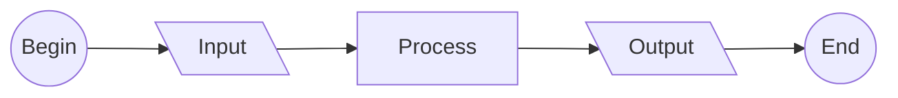

# 0010
A Mermaid flow chart example.




    ```mermaid
    graph LR
      B --> I --> P --> O --> E
      B(("Begin"))
      I[\"&nbsp;Input&nbsp;"\]
      P["Process"]
      O[\"&nbsp;Output&nbsp;"\]
      E(("&nbsp;End&nbsp;"))
    ```


[&bull;](README.md)
