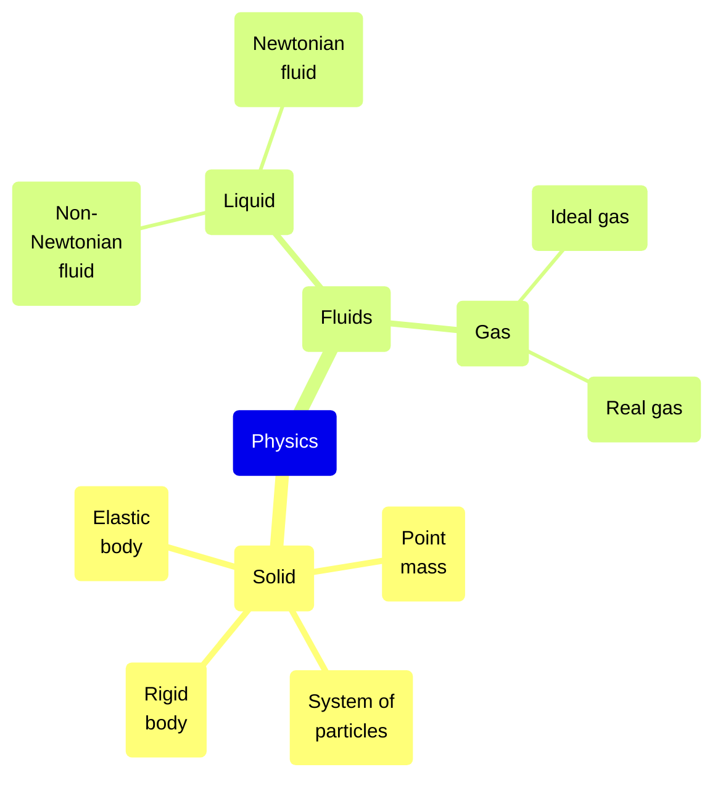

# 0011
A Mermaid mindmap example.

```mermaid
mindmap
  ("Physics")
    ("Solid")
      ("Point<br>mass")
      ("System of<br>particles")
      ("Rigid<br>body")
      ("Elastic<br>body")
    ("Fluids")
      ("Liquid")
        ("Newtonian<br>fluid")
        ("Non-<br>Newtonian<br>fluid")
      ("Gas")
        ("Ideal gas")
        ("Real gas")
```

[&bull;](README.md)
