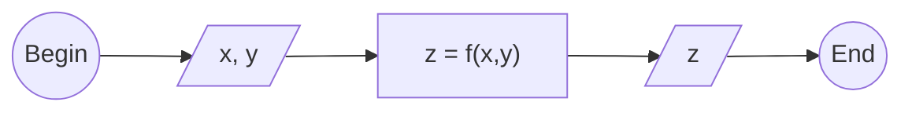

# 0012
Another Mermaid flowchart example.

$$\tag{1}
f(x,y) = x + y
$$

$$\tag{2}
f(x,y) = x - y
$$

$$\tag{3}
f(x,y) = xy
$$

$$\tag{4}
f(x,y) = \frac{x}{y}
$$

$$\tag{5}
f(x,y) = x^y
$$

$$\tag{6}
f(x,y) = \sqrt[y]{x}
$$

[&bull;](README.md)
[`0010`](../00/10.md)
