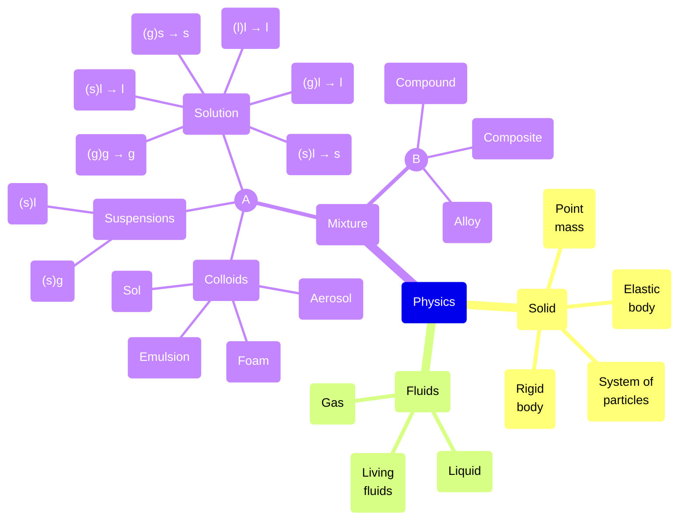

# 0011
A Mermaid mindmap example.

Above diagram is deduced from following references.

+ `30-jan-2023` [Colloids](https://chem.libretexts.org/Bookshelves/Physical_and_Theoretical_Chemistry_Textbook_Maps/Supplemental_Modules_(Physical_and_Theoretical_Chemistry)/Physical_Properties_of_Matter/Solutions_and_Mixtures/Colloid).
+ `25-aug-2020` [Types of Solutions - Some Terminology](https://chem.libretexts.org/Bookshelves/General_Chemistry/Map%3A_General_Chemistry_(Petrucci_et_al.)/13%3A_Solutions_and_their_Physical_Properties/13.01%3A_Types_of_Solutions%3A_Some_Terminology).
+ `13-aug-2020` [Colloids and Suspensions](https://chem.libretexts.org/Courses/University_of_Kentucky/UK%3A_CHE_103_-_Chemistry_for_Allied_Health_(Soult)/Chapters/Chapter_7%3A_Solids_Liquids_and_Gases/7.6%3A_Colloids_and_Suspensions).
+ `01-jun-2023` [Suspensions and Colloids](https://chem.libretexts.org/Courses/Grand_Rapids_Community_College/CHM_110%3A_Chemistry_of_the_Modern_World_(Neils)/6%3A_Solutions/6.3_Suspensions_and_Colloids).
+ `05-may-2020` [The Difference Between Alloys and Composites (and Compounds)](https://msestudent.com/the-difference-between-alloys-and-composites-and-compounds/).

[&bull;](README.md)
[`0010`](../00/10.md)
