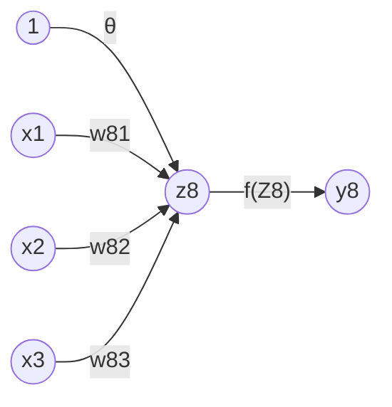

# 0022
A computing unit of Artificial Neural Network.

$$\tag{1}
z_8 = \theta + \sum_{i = 1}^3 w_{8i} x_i.
$$

$$\tag{2}
y_8 = f(z_8).
$$

$$\tag{3}
f(z) = \left\{
\begin{array}{lc}
0, & z < z_L, \newline
\in (0, 1), & z_L \le z \le z_R, \newline
1, & z_R < z.
\end{array}
\right.
$$

One example of $f(x)$ is the sigmoid function $\sigma(x)$.

[&bull;](README.md)
[`0014`](../00/14.md)
[`0015`](../00/15.md)
