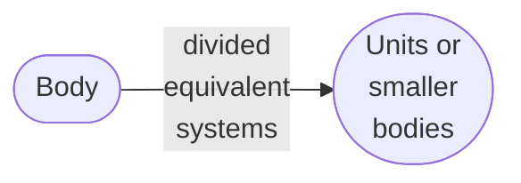

# 0021
Learning application of FEM from A. Tura and Z. Dong \
url https://www.engr.uvic.ca/~mech410/old/index.html
+ [Introduction to Finite Element Analysis (FEA) or Finite Element Method (FEM)](https://www.engr.uvic.ca/~mech410/old/2_Lecture_Notes/6_2_FEA_Theory.pdf)
+ [Mesh Generation](https://www.engr.uvic.ca/~mech410/old/2_Lecture_Notes/FEA_Mesh_Generation.pdf)

## Discretization

## Model

[&bull;](README.md)
[`0021`](../00/21.md)
