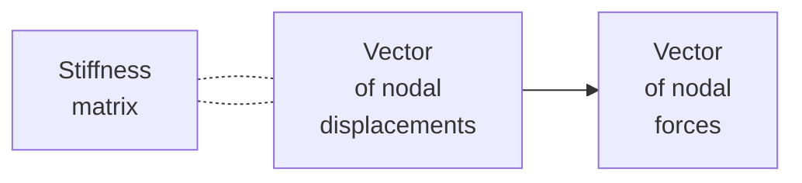

# 0034
General form of FEM according to [ChatGPT](https://chat.openai.com/) on `06-apr-2023`.

$$\tag{1}
\mathbf{K} \mathbf{u} = \mathbf{F}.
$$

  
([Wikimedia, 2009](https://en.wikipedia.org/wiki/File:Components_stress_tensor_cartesian.svg))

$$\tag{2}
\left[
\begin{array}{ccc}
T_1 & T_2 & T_3
\end{array}
\right] =
\left[
\begin{array}{ccc}
e_1 & e_2 & e_3
\end{array}
\right]
\left[
\begin{array}{ccc}
\sigma_{11} & \sigma_{12} & \sigma_{13} \newline
\sigma_{21} & \sigma_{22} & \sigma_{23} \newline
\sigma_{31} & \sigma_{32} & \sigma_{33}
\end{array}
\right]

$$

[&bull;](README.md)
