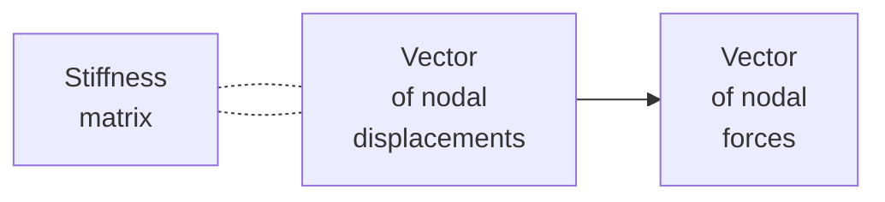

# 0034
General form of FEM according to [ChatGPT](https://chat.openai.com/) on `06-apr-2023`.

```mermaid
flowchart LR
  K -.- u --> F
  K -.- u
  K["Stiffness<br>matrix"]
  u["Vector<br>of nodal<br>displacements"]
  F["Vector<br>of nodal<br>forces"]
```

$$\tag{1}
\mathbf{K} \mathbf{u} = \mathbf{F}.
$$

[&bull;](README.md)
