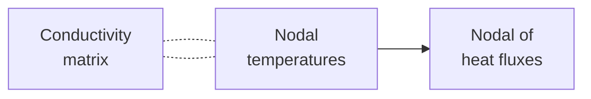
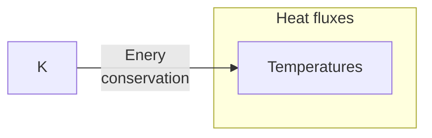

# 0035
General form of FEM according to [ChatGPT](https://chat.openai.com/) on `06-apr-2023`.

$$\tag{1}
\mathbf{K} \mathbf{u} = \mathbf{F}.
$$

$$\tag{2}
\vec{q} = -\kappa \vec{\nabla} T.
$$

[&bull;](README.md)
[`0034`](../00/34.md)
