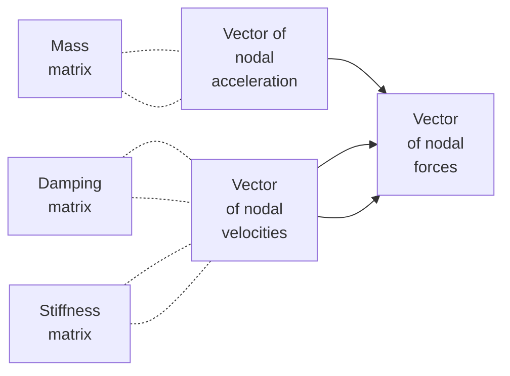
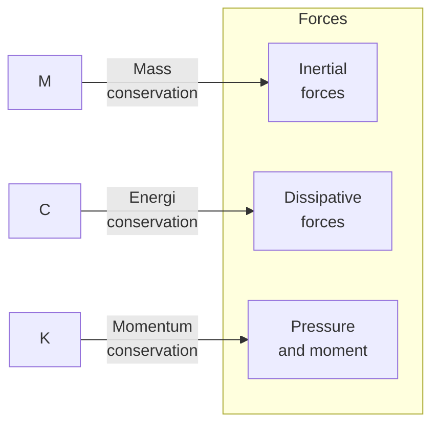

# 0036
General form of FEM according to [ChatGPT](https://chat.openai.com/) on `06-apr-2023`.

$$\tag{1}
\mathbf{M} \frac{d \mathbf{u} }{dt} + \mathbf{C} \mathbf{u} + \mathbf{K} \mathbf{u} = \mathbf{F}.
$$

$$\tag{2}
\frac{\partial \vec{u}}{\partial t} + (\vec{u} \cdot \vec{\nabla}) \ \vec{u} = - \frac{1}{\rho} \vec{\nabla} p + \mu \nabla^2 \vec{u} + \vec{f}.
$$

[&bull;](README.md)
[`0034`](../00/34.md)
[`0035`](../00/35.md)
